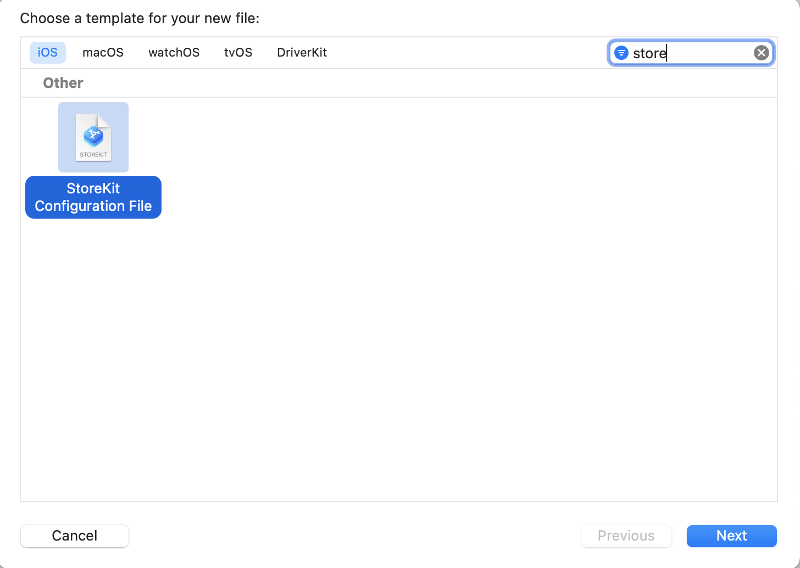
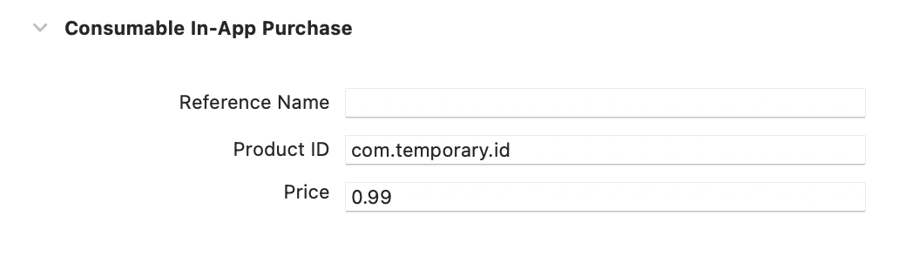

# SettingsKit

This is a static library that helps you add an out-of-the-box Settings page to your app. 

## Features
Features that can be included into the settings page: 
 - Request a review in App Store
 - Share your app with others
 - Donate to the app screen  (with [DonationKit](https://github.com/iOSerler/DonationKit))
 - Local notifications (with [NotificationKit](https://github.com/iOSerler/NotificationKit))
 - Open any webpage

 <!--  -->


## Installation
Add to Podfile. 

```
use frameworks!

pod 'NotificationKit', :git => 'https://github.com/iOSerler/NotificationKit', :branch => 'main'
pod 'DonationKit', :git => 'https://github.com/iOSerler/DonationKit', :branch => 'main'
pod 'SettingsKit', :git => 'https://github.com/iOSerler/SettingsKit', :branch => 'main'
```


## Usage
Create an object of **SettingsBuilder**.
Then push *settingsView*, property of the SettingsBuilder, to the *navigationController*.

If you pass *nil* to all parameters SettingsBuilder will use *Default* configurations.
For example:

```
let settingsPage = SettingsBuilder(
        analytics: nil,
        settingsSections: nil,
        notificationControlPanel: nil,
        notificationLocalSchedule: nil,
        settingsStyleConfigurable: nil
    )

self.navigationController?.pushViewController(settingsPage.settingsView, animated: true)
```
Also, **SettingsViewDelegate** should be implemented to make *Donation* work. For example:
```
extension ViewController: SettingsViewDelegate {
    func openDonateProposition() {
        //create purchaseBuilder
        let purchaseBuilder = PurchaseBuilder(
            analytics: nil,
            purchaseProductIdentifiers: [
                "com.temporary.id.099",
                "com.temporary.id.299",
                "com.temporary.id.1599"
            ],
            config: nil
        )
        
        //push to the navigationController
        self.navigationController?.pushViewController(purchaseBuilder.view as! UIViewController, animated: true)
        self.navigationController?.isNavigationBarHidden = false
    }
}
```


To use DonationKit you need to do several steps:
1. Create **StoreKit Configuration File**. 


2. Open created file and click the "+" button to add in-app purchase.


3. Then set configurations


4. Product -> Scheme -> Edit Scheme. And for the **StoreKit Configuration** set your configuration file.


**openDonateProposition()** creates **PurchaseBuilder** object.  **purchasheProductIdentifiers** accepts an array with **product ID**s of your purchase items.


