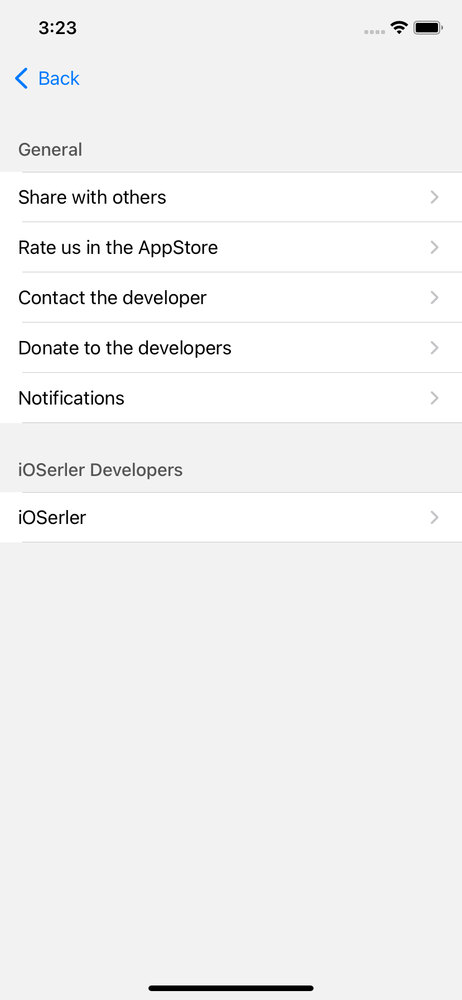
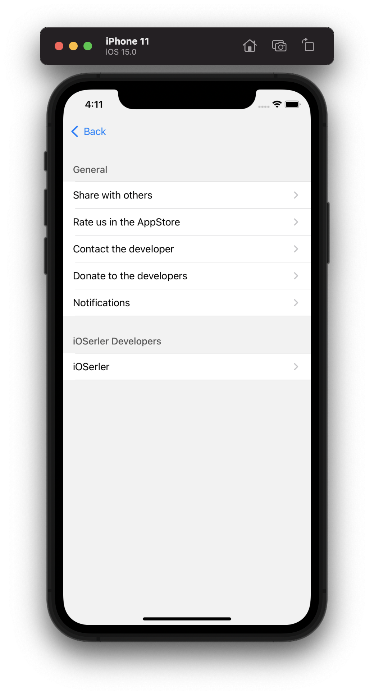

# SettingsKit

This is a static library that helps to build settings page quickly. Features that can be included into the settings page: 
 - Request a review in App Store
 - Share with others
 - Donation to an app   (with [DonationKit](https://github.com/iOSerler/DonationKit))
 - Local notifications  (with [NotificationKit](https://github.com/iOSerler/NotificationKit))
 - Open any webpage

 <!--  -->


## Installation
Add to Podfile. 

```
use frameworks!

pod 'NotificationKit', :git => 'https://github.com/iOSerler/NotificationKit', :branch => 'main'
pod 'DonationKit', :git => 'https://github.com/iOSerler/DonationKit', :branch => 'main'
pod 'SettingsKit', :git => 'https://github.com/iOSerler/SettingsKit', :branch => 'main'
```


## Usage
Create an object of **SettingsBuilder**.
Then push *settingsView*, property of the SettingsBuilder, to the *navigationController*.

If you pass *nil* to all parameters SettingsBuilder will use *Default* configurations.
For example:

```
let settingsPage = SettingsBuilder(
        analytics: nil,
        settingsSections: nil,
        notificationControlPanel: nil,
        notificationLocalSchedule: nil,
        settingsStyleConfigurable: nil
    )

self.navigationController?.pushViewController(settingsPage.settingsView, animated: true)
```
<!--  -->




